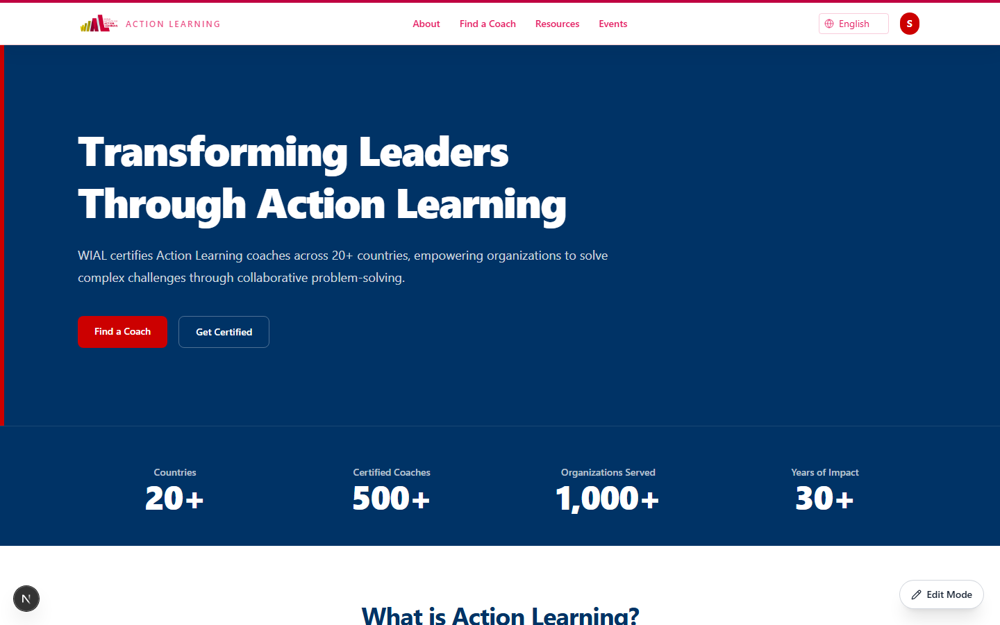
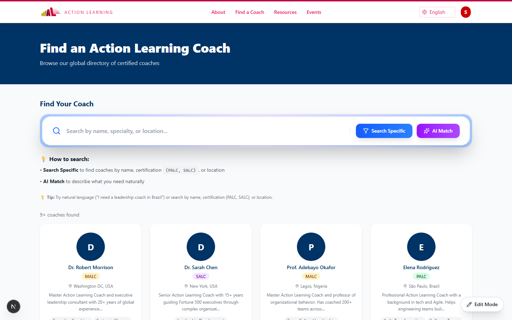
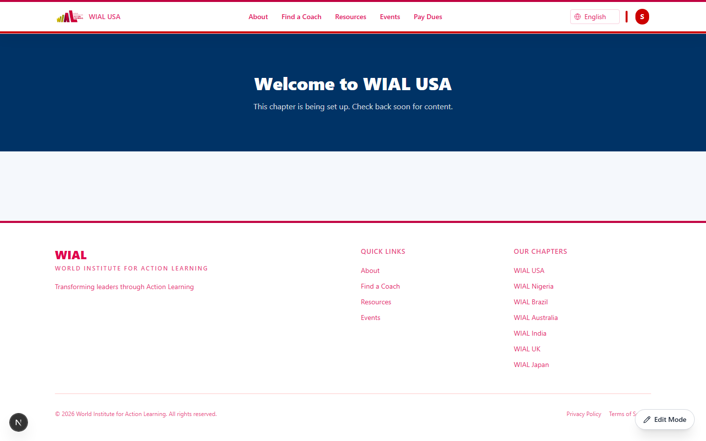
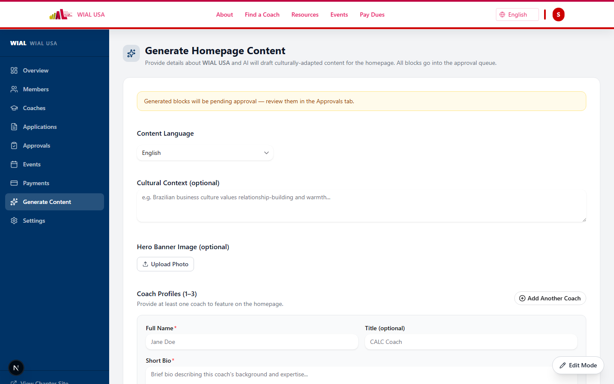
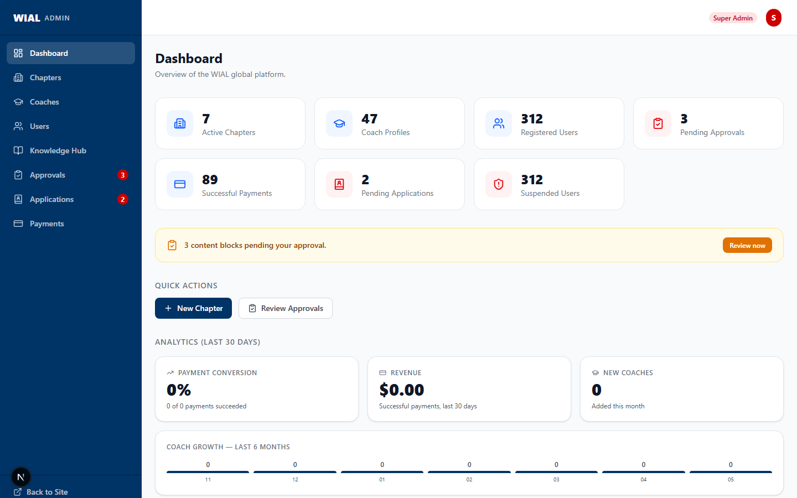
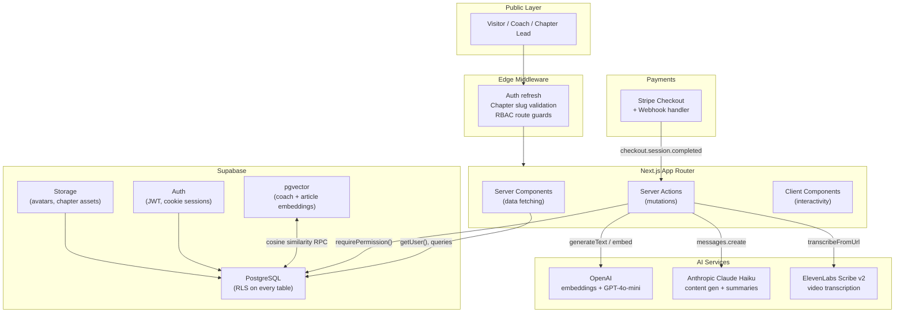

# WIAL Global Platform — Sync&Solve

**Multi-site ecosystem for a global non-profit coaching network, with AI-powered coach discovery, inline CMS, and Stripe payments.**

> 2026 ASU WiCS × Opportunity Hack Hackathon · Team Sync&Solve
> [DevPost](https://devpost.com/software/byte-me) · [Hackathon](https://www.ohack.dev/hack/2026_spring_wics_asu)

---

## Overview

WIAL (World Institute for Action Learning) certifies Action Learning coaches across 20+ countries. Their operations were fragmented: inconsistent chapter websites, no centralised coach directory, and manual payment workflows.

This platform gives each regional chapter an independent sub-site with shared WIAL branding, a visually editable CMS, and Stripe dues collection — all governed by a five-level RBAC system and a single Supabase database.

**Core problem solved:** Brand consistency without sacrificing local autonomy. A chapter lead in Nigeria should be able to edit their homepage hero, list upcoming events, and manage their coach roster — while the global super admin retains final approval authority.

---

## Preview

| Global Homepage | Coach Directory |
|:-:|:-:|
|  |  |

| WIAL USA Chapter Site | AI Content Generator |
|:-:|:-:|
|  |  |

| Super Admin Dashboard |
|:-:|
|  |

> **Live DevPost submission:** [devpost.com/software/byte-me](https://devpost.com/software/byte-me)

---

## Highlights

- **Multi-tenant CMS on a single database.** Chapters are rows; row-level security policies ensure a chapter lead in Brazil can only touch their own content. No cross-tenant leakage is possible at the DB layer.

- **AI coach matching across languages.** A natural-language query (in any language) hits GPT-4o-mini to extract country, certification level, and a semantic intent, then runs a pgvector cosine-similarity search. Claude explains why the top results match.

- **Chapter content generation via Claude.** Admins input coach bios, an upcoming event, and a testimonial. Claude Haiku produces a culturally adapted homepage — hero, about, stats, testimonial, CTA — in English, Portuguese, Spanish, French, Arabic, German, or Japanese. Output is validated with Zod schemas before upsertion.

- **Video-to-knowledge pipeline.** ElevenLabs Scribe v2 transcribes uploaded videos; Claude then generates a 3–4 sentence summary. Both are persisted and indexed so knowledge workers can search across transcripts.

- **Approval-gated inline editing.** Hero blocks and CTAs require super-admin approval before publishing. Text, stats, and events publish instantly. An auto-trigger creates version rows on every change, and a side-by-side content diff is shown in the approval queue.

- **Production-quality security posture.** Every table has RLS. Server actions use `getUser()` (JWT-validated), never `getSession()`. Stripe webhook signatures are verified on every event. Zod validates all external input. A full `audit_log` table captures every significant mutation.

---

## Use Cases

| Use Case | User | Outcome |
|----------|------|---------|
| Find a coach by domain need | Public visitor | Semantic search returns ranked matches with AI explanation |
| Edit chapter homepage | Chapter lead (Nigeria, USA, etc.) | Inline edit mode; hero/CTA changes queued for approval |
| Generate localised site copy | Chapter lead | Claude produces full page in selected language in one click |
| Process annual membership dues | Coach | Stripe Checkout → webhook → `membership_status: active` |
| Approve submitted content | Super admin | Side-by-side diff, one-click approve/reject with audit trail |
| Upload research article | Knowledge admin | PDF parsed → AI summary + multilingual translations + embedding |
| Transcribe a webinar | Resource manager | ElevenLabs transcription → Claude summary saved to resource |

---

## Features

### Multi-Site Architecture
- Path-based chapter routing: `/usa`, `/nigeria`, `/brazil`, etc.
- Per-chapter accent colours, logos, and content — inherited from global template
- Chapter provisioning: admins create chapters; leads submit chapter requests through an approval flow
- Edge middleware validates chapter slugs, refreshes auth, enforces RBAC per route

### Inline CMS & Content Blocks
- 14 block types: `hero`, `text`, `image`, `cta`, `team_grid`, `coach_list`, `event_list`, `testimonial`, `faq`, `contact_form`, `stats`, `video`, `divider`, `client_grid`
- Edit mode toggle (chapter leads/editors only) — blue dashed borders, hover toolbar
- Instant publish vs approval-gated blocks, configurable per block type in the registry
- Version history via Postgres trigger; side-by-side diff in admin approval queue
- tiptap (ProseMirror) rich text loaded dynamically only in edit mode

### Coach Directory
- Global directory + per-chapter filtered view
- PostgreSQL `tsvector` full-text search (weighted: bio A, specializations B, location C)
- pgvector cosine-similarity semantic search via OpenAI embeddings
- AI Smart Match: natural-language → structured filters + semantic query → ranked results + explanation
- Certification levels: CALC, PALC, SALC, MALC
- Coach self-application with Credly badge URL validation
- Profile changes queued as `pending_changes` for admin approval

### RBAC & User Management
- Five roles: `super_admin › chapter_lead › content_editor = coach › user`
- Multi-chapter roles: one user can be a coach in USA and a chapter lead in Nigeria
- Three suspension levels: account, chapter role, coach profile visibility
- Centralised `PERMISSION_MATRIX` — change one line to reconfigure who can do what
- `PermissionGate` component wraps UI elements; server actions call `requirePermission()`
- Last-admin protection prevents the final super admin from being suspended or demoted

### Events & Resources
- Chapter and global events with multi-timezone support
- Event registration with capacity limits
- Resource library: articles, videos, PDFs with completion tracking and certification mapping
- AI-generated article summaries (GPT-4o-mini) + multilingual translations (ES, PT, FR) + vector embeddings

### Payments
- Stripe Checkout (hosted page — PCI scope delegated to Stripe)
- Payment types: enrollment fee, certification fee, membership dues, event registration
- Webhook handler verifies Stripe signature; idempotency via `stripe_checkout_session_id`
- Membership status updated on webhook: `membership_status = 'active'`, expires 1 year out

### AI & Knowledge Engine
- PDF ingestion: parse → GPT-4o-mini analysis → summary + key findings + relevance tags + translations + embedding
- Webinar marketing generator: LinkedIn post, email subject/body, content outline
- Chapter homepage generator: Claude Haiku, 7 languages, Zod-validated block upserts
- Video transcription: ElevenLabs Scribe v2 → Claude summary → persisted + indexed
- All AI output validated against the same Zod schemas used for manual edits

---

## Tech Stack

| Layer | Technology | Purpose |
|-------|-----------|---------|
| Framework | Next.js 16 (App Router) | SSG/ISR, Server Components, Server Actions, edge middleware |
| UI | HeroUI v3 + TailwindCSS v4 | 75+ accessible React Aria components, CSS-first theming |
| Database | Supabase (PostgreSQL) | RLS, Auth, Storage, pgvector for semantic search |
| Auth | Supabase Auth + `@supabase/ssr` | Cookie-based sessions, `getUser()` JWT validation |
| Payments | Stripe Checkout + Webhooks | PCI-compliant hosted checkout, event-driven payment state |
| AI — Generation | Anthropic Claude Haiku | Chapter content generation, video transcript summarisation |
| AI — Search | OpenAI GPT-4o-mini + embeddings | Coach matching, knowledge analysis, webinar marketing |
| AI — Audio | ElevenLabs Scribe v2 | Video/audio transcription |
| AI — Local | Xenova Transformers (`multilingual-e5-small`) | Multilingual embedding for knowledge ingestion |
| Rich Text | tiptap (ProseMirror) | Inline editing, headless, SSR-compatible |
| i18n | next-intl | English MVP, infrastructure for 7+ languages |
| Validation | Zod v4 | All external input, AI output, form data, URL params |
| Email | Resend + `@react-email` | Transactional emails with React components |
| Testing | Vitest + Testing Library + Playwright + axe-core | Unit, integration, E2E, automated WCAG scanning |
| Deployment | Vercel | Edge functions, ISR, Brotli compression, image optimisation |

---

## Architecture



---

## How It Works

### Coach Discovery Flow
1. Visitor types a free-text query (any language) into the Smart Match box.
2. GPT-4o-mini parses the query into structured filters (country, certification, semantic intent) and detects language.
3. A Supabase RPC runs pgvector cosine-similarity search against coach profile embeddings.
4. GPT-4o-mini generates a 2–3 sentence explanation of why the top results match, in the visitor's language.
5. Results render as a ranked card grid with the AI explanation above.

### Inline Edit → Publish Flow
1. Chapter lead clicks "Edit Mode" — all editable blocks show blue dashed borders.
2. Click opens an inline editor; tiptap loads dynamically (not in initial bundle).
3. On save, the server action checks `requirePermission('content:edit', chapterId)`.
4. If the block is instant-publish: `status = 'published'`, live immediately, version row auto-created by trigger.
5. If approval-required: `status = 'pending_approval'`, live site shows old `published_version`.
6. Super admin reviews in `/admin/approvals` with side-by-side JSON diff, approves or rejects.

### AI Chapter Generation Flow
1. Admin opens `/[chapter]/manage/generate`, fills in coach bios, testimonial, upcoming event.
2. Selects language (EN/PT-BR/ES/FR/AR/DE/JA) and optional cultural context note.
3. Server action builds a structured prompt and calls Claude Haiku.
4. Response is parsed and each of the 5 block types is validated against Zod schemas.
5. Blocks are upserted as `pending_approval` draft versions — no live-site impact until approved.
6. Audit log entry records the generation event with metadata.

### Payment Flow
1. User selects payment type; server action validates amount and creates a Stripe Checkout Session.
2. Redirect to Stripe-hosted checkout page (card data never touches WIAL servers).
3. `POST /api/payments/webhooks` receives `checkout.session.completed`, verifies Stripe signature.
4. Payment row created; if type is `membership_dues`, profile `membership_status` set to `active`.

---

## Setup

### Prerequisites
- Node.js 20+
- A Supabase project (free tier works)
- Stripe account (test mode)
- OpenAI API key (for AI features)
- Anthropic API key (for content generation / transcription summaries)
- ElevenLabs API key (for video transcription, optional)

### Install

```bash
git clone https://github.com/ak-asu/24-sync-solve.git
cd 24-sync-solve
npm install
```

### Environment Variables

```bash
cp .env.local.example .env.local
```

Fill in `.env.local`:

```bash
# Supabase
NEXT_PUBLIC_SUPABASE_URL=https://your-project-id.supabase.co
NEXT_PUBLIC_SUPABASE_PUBLISHABLE_KEY=your_publishable_key
SUPABASE_SECRET_KEY=your_secret_key

# Stripe
NEXT_PUBLIC_STRIPE_PUBLISHABLE_KEY=pk_test_...
STRIPE_SECRET_KEY=sk_test_...
STRIPE_WEBHOOK_SECRET=whsec_...

# App
NEXT_PUBLIC_SITE_URL=http://localhost:3000

# Email (Resend)
RESEND_API_KEY=re_...
EMAIL_FROM=WIAL Global <noreply@wial.org>

# AI Services (server-only — never use NEXT_PUBLIC_ prefix)
ANTHROPIC_API_KEY=...
OPENAI_API_KEY=...               # for AI SDK embeddings + GPT-4o-mini
ELEVENLABS_API_KEY=...           # optional, for video transcription
```

### Database

```bash
# Apply migrations and seed development data
npm run db:reset
npm run db:seed

# Seed the AI knowledge base (requires OPENAI_API_KEY)
npx tsx scripts/seed_ai.ts

# Regenerate TypeScript types after schema changes
npm run db:generate-types
```

### Run Locally

```bash
npm run dev
# → http://localhost:3000
```

### Tests

```bash
npm run test              # unit + integration (Vitest)
npm run test:coverage     # with coverage report
npm run test:e2e          # end-to-end (Playwright)
npm run type-check        # TypeScript strict check
npm run lint              # ESLint (includes jsx-a11y)
```

### Build & Analyse

```bash
npm run build             # production build
npm run analyze           # bundle analyser (requires ANALYZE=true)
```

---

## Usage

### Navigating Chapter Sites

```
/                    → Global WIAL homepage
/coaches             → Global coach directory with AI smart match
/events              → Global events calendar
/usa                 → USA chapter homepage
/nigeria/coaches     → Nigeria chapter coach directory
/[chapter]/pay       → Stripe dues checkout for a chapter
```

### Admin Routes

```
/admin               → Super admin dashboard
/admin/approvals     → Content approval queue (side-by-side diff)
/admin/chapters      → Chapter management + AI content generator
/admin/knowledge     → Knowledge base + PDF upload

/[chapter]/manage           → Chapter admin dashboard
/[chapter]/manage/users     → Role assignment + suspension
/[chapter]/manage/coaches   → Coach applications + visibility
/[chapter]/manage/approvals → Chapter-level content queue
```

### AI Smart Match (Coach Directory)

Type a natural-language query in any language:

```
"leadership coach in Brazil with SALC certification"
"entrenador para innovación en manufactura"
"coach spécialiste gouvernance pour ONG"
```

The system parses intent, runs semantic + keyword search, and returns ranked results with an explanation.

---

## Key Decisions

| Decision | Rationale | Tradeoff |
|----------|-----------|----------|
| Single DB with RLS (not multi-DB) | Supabase's native strength; no cross-DB joins needed; row-level isolation is sufficient | All chapters share infrastructure; large-scale chapter growth would need sharding strategy |
| Path-based chapter routing (`/[chapter]`) | No DNS complexity; works with Vercel's edge; simpler local dev | Less URL prestige than subdomains; slug must be globally unique |
| JSONB content blocks | Flexible schema; easy versioning (store whole JSONB snapshot); block types added without migrations | Harder to query field-level data; no DB-level constraints on JSONB shape (Zod compensates) |
| Approval-gated CMS | Preserves brand integrity; chapter leads can edit freely without risk | Adds latency for high-trust content; requires super admin availability |
| Server Components by default | Minimal client JS; ISR-friendly; no hydration overhead for display-only pages | Edit mode must dynamically load tiptap/editors client-side |
| Stripe Checkout (hosted) | Zero PCI scope; no card data on WIAL servers; battle-tested fraud tooling | Less UI control than Stripe Elements; no fully custom checkout experience |
| Claude for content generation, OpenAI for search | Claude produces higher-quality structured prose; OpenAI `text-embedding-3-small` has the widest pgvector adoption | Two vendor dependencies; cost varies by usage pattern |
| Centralised `PERMISSION_MATRIX` | Single source of truth for who can do what; reconfigure by changing one array | Type-level permissions don't automatically propagate — must still wire server action checks |

---

## Innovation & Notable Engineering

**Hybrid search relevance model.** Coach search combines PostgreSQL `tsvector` (keyword recall) with pgvector cosine similarity (semantic recall), with business-rule filters (certification level, chapter, published status) applied as hard constraints post-ranking. The intuition: `relevance ≈ α·semantic + β·text + γ·business_constraints`.

**AI output validated against the same schemas as manual edits.** Every content block Claude generates passes through the Zod schema registry before upsertion. If Claude hallucinates an extra key or wrong type, the server action rejects the block and returns a clear error — not a silent DB corruption.

**Auto-versioning trigger.** A Postgres `BEFORE UPDATE` trigger fires on every `content_blocks` change, inserting a snapshot into `content_versions`. No application code needs to remember to call a versioning function — the invariant is enforced at the DB layer.

**Suspension-aware RLS functions.** The `get_user_role()` DB function returns `'user'` when a profile has `is_suspended = true` — so suspended users lose permissions at the RLS layer, not just in application checks. The `user_has_chapter_role()` function filters on `is_active = true`, making role suspension immediate.

**Dynamic import discipline.** tiptap (~200 KB), Stripe Elements, and the AI SDK are never in the initial bundle. They load only when edit mode is toggled or a payment flow is initiated — keeping content page JS under the 100 KB target.

**Multilingual knowledge ingestion.** Uploaded PDFs are parsed, chunked, analysed by GPT-4o-mini (summary, tags, key findings), translated to ES/PT/FR, and embedded using either OpenAI or the locally-run `multilingual-e5-small` (Xenova Transformers) — no API round-trip required for embedding in supported languages.

---

## Quality

- **Type safety:** TypeScript strict mode with `noUncheckedIndexedAccess`; Supabase-generated types for all DB tables; no `any` (enforced by ESLint)
- **Validation:** Zod on all external input — forms, URL params, API payloads, and AI output
- **Testing:** Vitest unit tests, Testing Library integration tests, Playwright E2E with `@axe-core/playwright` automated WCAG scans on every page
- **Accessibility:** WCAG 2.1 AA target — React Aria via HeroUI, `eslint-plugin-jsx-a11y`, skip-to-content link, `aria-live` error regions, focus trapping in modals
- **Git hygiene:** Husky pre-commit (lint-staged), commitlint conventional commits, Prettier + Tailwind class sorting
- **Security:** RLS on every table, parameterised queries, strict CSP headers in `next.config.ts`, webhook signature verification, `X-Frame-Options: DENY`
- **Observability:** `audit_log` table (user, action, entity, old/new value, IP, user-agent), Vercel runtime logs

---

## Roadmap

- **Stripe Connect** for chapter-level payouts (stripe_account_id column is already in the schema)
- **Real-time collaboration** on content blocks — multiple editors, presence indicators
- **Stronger multilingual UX** — locale prefix routing, translation quality review workflow
- **Chapter analytics dashboard** — traffic, coach engagement, payment conversion, export to CSV
- **Calendar integrations** — Google Calendar / Outlook sync for events
- **Feature flags** — per-chapter progressive rollout of new block types and AI features

---

## Team

| Name |
|------|
| Aakash Khepar |
| Bhavya Nimesh Shah |
| Debaleena Chakraborty |
| Shrey Bishnoi |

Built at the **2026 ASU WiCS × Opportunity Hack Hackathon** as a practical response to a real operational gap in WIAL's global infrastructure.

---

## License

[MIT](LICENSE)
